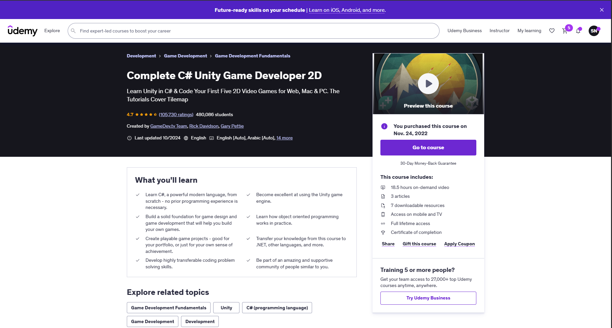
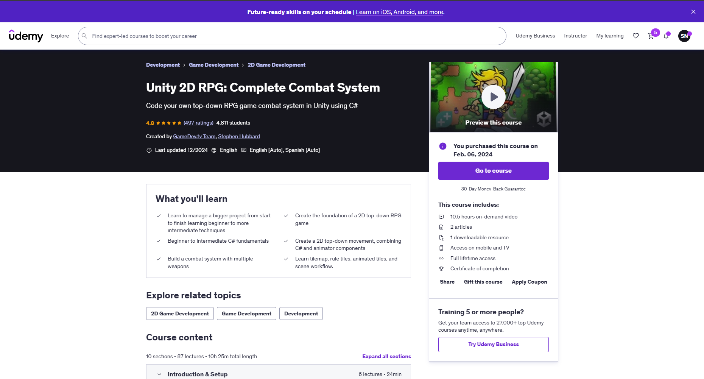
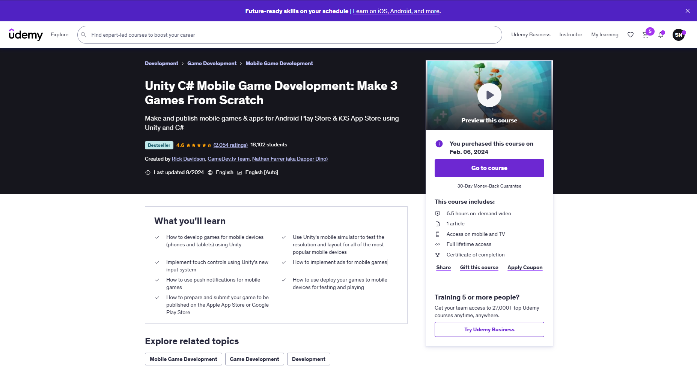
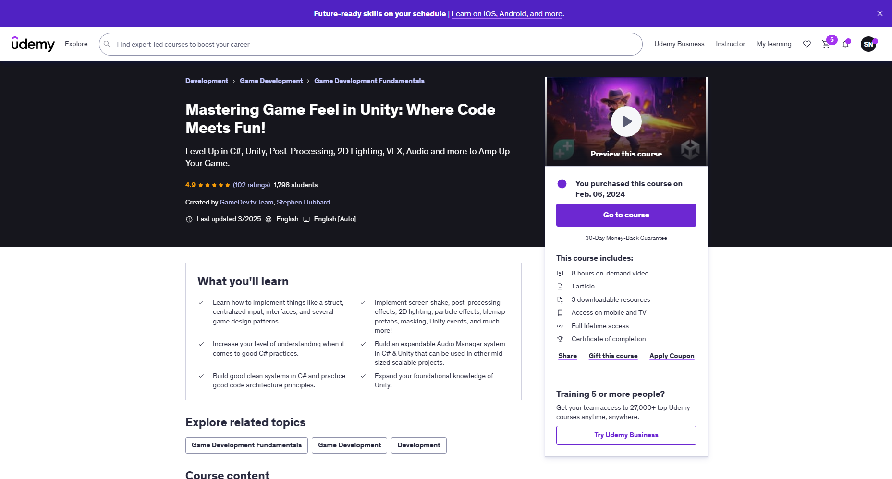
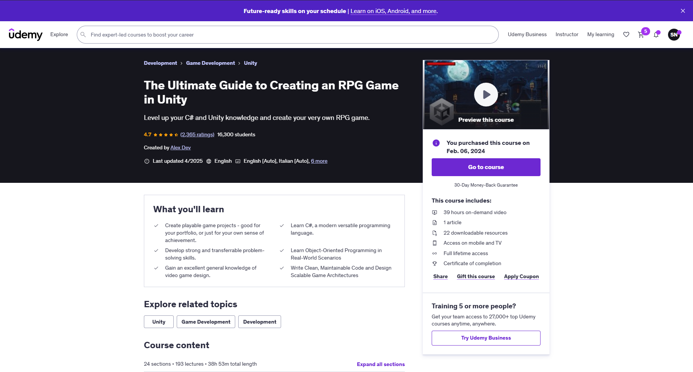

# My-Certificates

For storing all my achieved certificates

## GitHub Certificates

1. [GitHub Foundation Certificate](./GitHub/GitHub+Foundations.pdf)

## Study Plan

### Web Development :globe_with_meridians:

### Game Development :video_game:

- [ ] [Complete C# Unity Game Developer 2D](#complete-c-unity-game-developer-2d)
- [ ] [Unity 2D RPG: Complete Combat System](#unity-2d-rpg-complete-combat-system)
- [ ] [Unity C# Mobile Game Development: Make 3 Games From Scratch](#unity-c-mobile-game-development-make-3-games-from-scratch)
- [ ] [Mastering Game Feel in Unity: Where Code Meets Fun!](#mastering-game-feel-in-unity-where-code-meets-fun)
- [ ] [The Ultimate Guide to Creating an RPG Game in Unity](#the-ultimate-guide-to-creating-an-rpg-game-in-unity)

Details

#### [Complete C# Unity Game Developer 2D]

#### [Unity 2D RPG: Complete Combat System]

#### [Unity C# Mobile Game Development: Make 3 Games From Scratch]

#### [Mastering Game Feel in Unity: Where Code Meets Fun!]

#### [The Ultimate Guide to Creating an RPG Game in Unity]

---

[Complete C# Unity Game Developer 2D]: https://www.udemy.com/course/unitycourse
[Unity 2D RPG: Complete Combat System]: https://www.udemy.com/course/unity-2d-rpg
[Unity C# Mobile Game Development: Make 3 Games From Scratch]: https://www.udemy.com/course/unity-mobile
[Mastering Game Feel in Unity: Where Code Meets Fun!]: https://www.udemy.com/course/mastering-game-feel-in-unity
[The Ultimate Guide to Creating an RPG Game in Unity]: https://www.udemy.com/course/2d-rpg-alexdev
